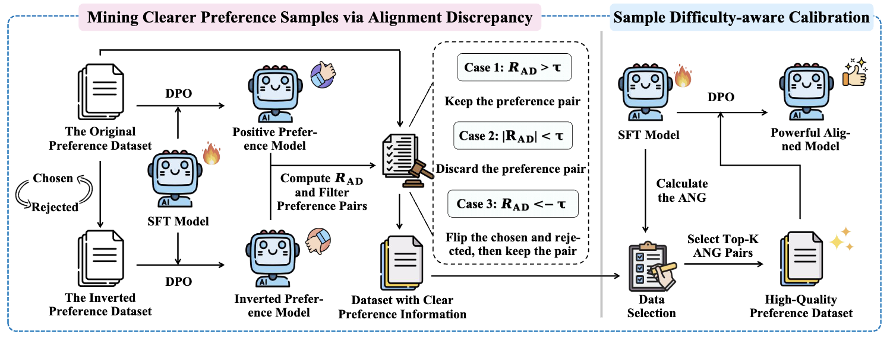

<div align="center">

# AlignDiff: Exploiting Model-Intrinsic Information for Better Preference Data Selection

**Official implementation** of our EMNLP 2026 Findings paper.

[Installation](#installation) • [Reproduction](#reproduction) • [Citation](#citation)



</div>

---

> AlignDiff filters preference data using **only model-intrinsic signals**: Alignment Discrepancy (RAD) for polarity, then Average Negative Log-Likelihood Gap (ANG) for difficulty. DPO on the top-30k subset outperforms training on the full UltraFeedback set and seven strong filters.

## News

- **[2026.08]** AlignDiff is accepted to **EMNLP 2026 Findings** 🎉

## Installation

```bash
git clone https://github.com/Laip11/AlignDiff.git
cd AlignDiff
conda create -n aligndiff python=3.10 -y
conda activate aligndiff
pip install torch --index-url https://download.pytorch.org/whl/cu124   # pick the CUDA build you need
bash scripts/setup_env.sh
cp configs/local.env.example configs/local.env   # set GPUs
```

`scripts/setup_env.sh` installs this package and the vendored [OpenRLHF](OpenRLHF/README.md) trainer (Appendix G). FlashAttention is optional: `FLASH_ATTN=1 bash scripts/setup_env.sh`.

Filter and margin scoring only need `pip install -e .`.

## Data and Models

We **do not** train SFT from scratch. DPO is initialized from the public UltraChat SFT checkpoints used in the paper:

| Role | Checkpoint |
| --- | --- |
| LLaMA-3-8B-SFT | [`princeton-nlp/Llama-3-Base-8B-SFT`](https://huggingface.co/princeton-nlp/Llama-3-Base-8B-SFT) |
| Qwen2.5-7B-SFT | [`glorgao/Qwen2.5-7B-SFT`](https://huggingface.co/glorgao/Qwen2.5-7B-SFT) |
| Preference data | [`HuggingFaceH4/ultrafeedback_binarized`](https://huggingface.co/datasets/HuggingFaceH4/ultrafeedback_binarized) (`train_prefs`) |

```bash
bash scripts/01_prepare_data.sh
# writes (created at runtime, gitignored):
#   data/ultrafeedback_binarized.jsonl
#   data/ultrafeedback_binarized_flipped.jsonl
```

JSONL is OpenRLHF format: `prompt`, `chosen`, `rejected`. Checkpoints go under `saves/` (also gitignored).

## Reproduction

End-to-end (Qwen2.5-7B-SFT; swap `qwen` for `llama`):

```bash
bash scripts/run_pipeline.sh qwen
```

| Step | Script | Description |
| :---: | --- | --- |
| 1 | `scripts/01_prepare_data.sh` | Convert UltraFeedback to prompt/chosen/rejected JSONL |
| 2 | `scripts/02_train_seed_dpo.sh qwen` | OpenRLHF DPO: `π_θ^pos` and inverse `π_θ^inv` |
| 3 | `scripts/03_compute_margins.sh qwen` | IM (`pos` vs SFT) and RAD (`pos` vs `inv`) |
| 4 | `scripts/04_filter_aligndiff.sh qwen` | RAD + τ, then ANG top-30k |
| 5 | `scripts/05_train_aligndiff_dpo.sh qwen` | OpenRLHF DPO on the filtered subset |

Main paper setting: **τ = 20**, **K = 30k**. Ablate τ with:

```bash
TAUS=10,20,30 bash scripts/04_filter_aligndiff.sh qwen
```

Optional easy-to-hard curriculum (Table 2):

```bash
CURRICULUM=easy-to-hard bash scripts/04_filter_aligndiff.sh qwen
```

Ad-hoc DPO (same recipe, from `OpenRLHF/`):

```bash
PRETRAIN=glorgao/Qwen2.5-7B-SFT \
  DATASET=data/filtered/qwen/aligndiff_tau20_30k.jsonl \
  SAVE_PATH=saves/qwen2.5-7b/full/dpo_aligndiff_tau20_30k \
  bash OpenRLHF/train_dpo.sh
```

### Hyperparameters (Appendix G)

All DPO runs use OpenRLHF, global batch 128, AdamW, cosine schedule, 10% warmup, **1 epoch**.

| | Value |
| --- | --- |
| Learning rate | `5e-7` |
| DPO β | `0.01` |
| Max length | 2048 |
| τ (LLaMA / Qwen) | 20 |
| τ (Mistral) | 80 |
| Top-K | 30,000 |

Steps 1 and 4 already wrap convert / filter. Re-run the filter by hand only if you already have margin files:

```bash
python -m aligndiff.filter \
    --im-margins data/margins/qwen_im_margins.jsonl \
    --rad-margins data/margins/qwen_rad_margins.jsonl \
    --out-dir data/filtered/qwen \
    --model-key qwen --top-k 30000 --tau 20
```

Baseline selectors (`im`, `em`, `lcpp`, `pplgap`, `map`, `im_em`, `rip`) are available via `--methods` and are **not** required for AlignDiff. EM scoring uses Qwen2.5-72B-Instruct (Appendix H).

## Repository Structure

```
.
├── assets/aligndiff.png      # method overview
├── OpenRLHF/                 # DPO trainer (Appendix G)
├── configs/local.env.example
├── environment.yml
├── scripts/
│   ├── setup_env.sh
│   ├── 01_prepare_data.sh … 05_train_aligndiff_dpo.sh
│   └── run_pipeline.sh
└── aligndiff/                # convert, margin scoring, RAD/ANG filter
```

Runtime artifacts (`data/`, `saves/`, `logs/`) are created by the scripts and gitignored.

## Acknowledgements

Our training recipe follows [OpenRLHF](https://github.com/OpenRLHF/OpenRLHF). Experiments use [UltraFeedback](https://huggingface.co/datasets/HuggingFaceH4/ultrafeedback_binarized) and the SFT checkpoints released by [SimPO](https://huggingface.co/princeton-nlp/Llama-3-Base-8B-SFT) and [SelectiveDPO](https://huggingface.co/glorgao/Qwen2.5-7B-SFT).

## Citation

If you find this repository or the paper useful, please cite:

```bibtex
@misc{lai2026aligndiff,
  title={AlignDiff: Exploiting Model-Intrinsic Information for Better Preference Data Selection},
  author={Peng Lai and He Zhu and Zhiwen Ruan and Dongdong Zhang and Yun Chen and Peng Li and Furu Wei and Yang Liu and Guanhua Chen},
  year={2026},
  url={https://openreview.net/forum?id=4fclVIrUg2}
}
```
